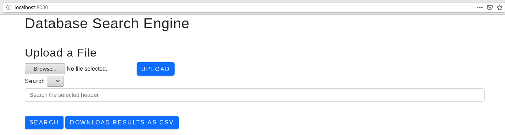
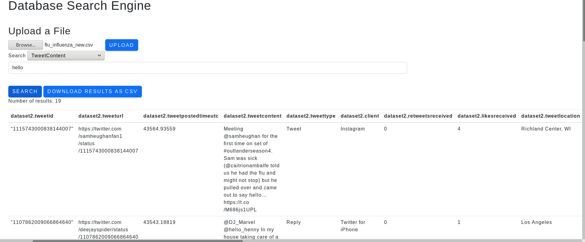
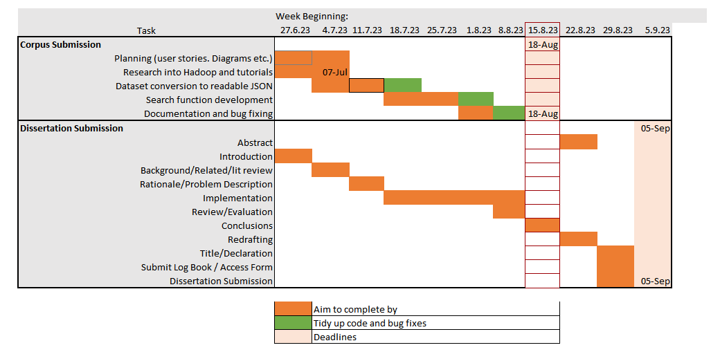
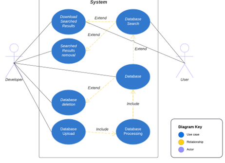

# Spring application connecting to Hive

This is a project that demonstrates how to take advantage of the cloud storage capabilities of Hive and HDFS.

## Table of Contents
- [Getting Started](#getting-started)
- [SSH Key Generation](#ssh-key-generation)
- [Installing Java 8](#installing-java-8)
- [Installing Hadoop](#installing-hadoop)
- [Setting Hadoop to Pseudo Distributed Mode](#setting-hadoop-to-pseudo-distributed-mode)
- [Setting Environment Variables](#setting-environment-variables)
- [Configuring Hadoop](#configuring-hadoop)
- [Verifying Hadoop Installation](#verifying-hadoop-installation)
- [Hive Installation](#hive-installation)
  - [Hive Environment Variables](#hive-environment-variables)
  - [Configuration](#configuration)
  - [Hive Configuration to Run MySQL](#hive-configuration-to-run-mysql)
  - [Hive Metastore and Hiveserver2](#hive-metastore-and-hiveserver2)
- [Running the Application](#running-the-application)
- [How to Use the Application](#how-to-use-the-application)
  - [CSV Upload](#csv-upload)
  - [Search](#search)
- [User Stories](#user-stories)

  
  

## Getting Started

This application requires a running pseudo-distributed Hadoop cluster on your local machine. If your machine is in Windows, it is recommended to run the application within a virtual machine that runs on **Linux**. Though Hadoop can be configured in Windows, it is mainly designed for Linux.

For the purposes of this application, **Hadoop 2.10.1** will be used, which is compatible with **Java 8**. As such, if a higher Java version is installed, you must install **Java 8**

## SSH Key Generation
First, ensure that SSH has been set up. If it has not been set up, enter the following commands to do so:

    ssh-keygen -t rsa 
    cat ~/.ssh/id_rsa.pub >> ~/.ssh/authorized_keys 
    chmod 0600 ~/.ssh/authorized_keys 
    ssh localhost

## Installing Java 8
Download Java at:
https://www.oracle.com/uk/java/technologies/javase/javase8-archive-downloads.html
This will download a tar.gz file that will need to be extracted.
In order to make java available to all users, move the extracted file to "**/usr/local**".
Then, set up the JAVA_HOME and PATH variables in the **~/.bashrc** file so that the "bin" file of the java is in the PATH variable.

## Installing Hadoop

First, verify if Hadoop is installed on the system:
`$ hadoop version`

If Hadoop is not installed or a different version to 2.10.1 is installed, download **Hadoop 2.10.1**. Extract the tar.gz file and move the contents to **/usr/local/hadoop/** to make it available to all users.
## Setting Hadoop to Pseudo Distributed Mode

Pseudo Distributed Mode essentially runs a Hadoop Cluster on the local machine, with the different nodes run as separate JVM instances.

## Setting environment variables

In order to configure Hadoop for this, the following commands need to be added to **~/.bashrc**:

    export HADOOP_HOME=/usr/local/hadoop
    export HADOOP_MAPRED_HOME=$HADOOP_HOME
    export HADOOP_COMMON_HOME=$HADOOP_HOME
    export HADOOP_HDFS_HOME=$HADOOP_HOME
    export YARN_HOME=$HADOOP_HOME
    export HADOOP_COMMON_LIB_NATIVE_DIR=$HADOOP_HOME/lib/native 
    export PATH=$PATH:$HADOOP_HOME/sbin:$HADOOP_HOME/bin
After adding the commands, remember to apply them with the following command:

    source ~/.bashrc
This sets up various configurations that Hadoop will need to carry out its processes. This also ensures that any hadoop commands can be called without having to cd into the directory.

## Configuring Hadoop

Configuration files are found at /etc/hadoop within the main directory of Hadoop. Use $HADOOP_HOME to easily find this directory:

    cd $HADOOP_HOME/etc/hadoop
Checking the contents will show various configuration files:

    [hadoop@localhost ~]$ cd $HADOOP_HOME/etc/hadoop
    [hadoop@localhost hadoop]$ ls
    capacity-scheduler.xml      httpfs-env.sh            mapred-env.sh
    configuration.xsl           httpfs-log4j.properties  mapred-queues.xml.template
    container-executor.cfg      httpfs-signature.secret  mapred-site.xml
    core-site.xml               httpfs-site.xml          mapred-site.xml.template
    hadoop-env.cmd              kms-acls.xml             slaves
    hadoop-env.sh               kms-env.sh               ssl-client.xml.example
    hadoop-metrics2.properties  kms-log4j.properties     ssl-server.xml.example
    hadoop-metrics.properties   kms-site.xml             yarn-env.cmd
    hadoop-policy.xml           log4j.properties         yarn-env.sh
    hdfs-site.xml               mapred-env.cmd           yarn-site.xml

We will need to make a number of edits to these files. First, edit the **hadoop-env.sh** file and replace the **JAVA_HOME** value with the main directory of your Java installation:

    export JAVA_HOME=/usr/local/YourJavaFile
Edit **core-site.xml** to configure the port number that Hadoop will listen for:

    <configuration>  
    	<property> 
    		 <name>fs.default.name</name>
    		 <value>hdfs://localhost:9000</value>  	
    	</property> 
     </configuration>

The next step is to edit **hdfs-site.xml**. However, this requires first creating directories which Hadoop will use to store information on the Namenode and Datanode.
In the below configurations, replace **NamenodePath** and **DatanodePath** with the corresponding paths of the directories you created before.
This installation guide also assumes a replication factor of 1 for simplicity as well. If more is desired, change the value of `dfs.replication`as required in the below configurations:

    <configuration>
    
       <property> 
          <name>dfs.replication</name> 
          <value>1</value> 
       </property> 
       <property> 
          <name>dfs.name.dir</name> 
          <value>file:/NamenodePath </value> 
       </property> 
       <property> 
          <name>dfs.data.dir</name>
          <value>file:/DatanodePath </value > 
       </property>
       
    </configuration>

Edit **yarn-site.xml** to configure yarn:

    <configuration>
    
       <property> 
          <name>yarn.nodemanager.aux-services</name> 
          <value>mapreduce_shuffle</value> 
       </property>
       
    </configuration>
**mapred-site.xml** is used to configure the MapReduce framework. However, this file is not normally found in the files. Instead, a template **mapred-site.xml** is provided. Change this to the appropriate file with the following command:

    cp mapred-site.xml.template mapred-site.xml

Edit the newly named file with the following:

    <configuration>
    
       <property> 
          <name>mapreduce.framework.name</name> 
          <value>yarn</value> 
       </property>
    
    </configuration>

## Verifying Hadoop Installation

Once Hadoop is installed and configured, it can be run and accessed in the browser.
First, run **start-dfs.sh** to start up the Hadoop file system

    start-dfs.sh
This should run the command if the environment variables are set up correctly. the following will be outputted after running the command:

       23/08/18 06:26:40 WARN util.NativeCodeLoader: Unable to load native-hadoop library for your platform... using builtin-java classes where applicable
        Starting namenodes on [localhost]
        localhost: starting namenode, logging to /home/hadoop/hadoop-2.10.1/logs/hadoop-root-namenode-localhost.localdomain.out
        localhost: starting datanode, logging to /home/hadoop/hadoop-2.10.1/logs/hadoop-root-datanode-localhost.localdomain.out
        Starting secondary namenodes [0.0.0.0]
        0.0.0.0: starting secondarynamenode, logging to /home/hadoop/hadoop-2.10.1/logs/hadoop-root-secondarynamenode-localhost.localdomain.out
        23/08/18 06:26:56 WARN util.NativeCodeLoader: Unable to load native-hadoop library for your platform... using builtin-java classes where applicable

Now we will start the yarn script to start the resource and node managers:

    start-yarn.sh
This will output the following:

    starting yarn daemons
    starting resourcemanager, logging to /home/hadoop/hadoop-2.10.1/logs/yarn-hadoop-resourcemanager-localhost.localdomain.out
    localhost: starting nodemanager, logging to /home/hadoop/hadoop-2.10.1/logs/yarn-root-nodemanager-localhost.localdomain.out

You can verify if these are running with the jps command. This will list out the running Hadoop processes. There should be 5 in total:

- Datanode
- Namenode
- SecondaryNameNode
- ResourceManager
- NodeManager

Alternatively, access Hadoop on the browser with **http://localhost:50070/**. **http://localhost:8088** can then be used to access the applications running on the cluster
## Hive Installation

After setting up Hadoop, next will be to install and configure Hive.
First, download **Apache Hive 2.3.9**, which is compatible with the downloaded version of Hadoop.
For consistency, we will also be moving this to its own directory in /usr/local/hive

### Hive Environment Variables
We will need to set up the necessary environment variables in **~/.bashrc**:

    export HIVE_HOME=/usr/local/hive
    export PATH=$PATH:$HIVE_HOME/bin
    export CLASSPATH=$CLASSPATH:/usr/local/Hadoop/lib/*:.
    export CLASSPATH=$CLASSPATH:/usr/local/hive/lib/*:.
Source the ~/.bashrc file with this command:

    source ~/.bashrc
These will point to the libraries of Hadoop and Hive to gain access to the various jar files stored there and will allow for calling Hive commands that are stored in /bin.

### Configuration
open the cong directory in the Hive main directory:

    cd $HIVE_HOME/conf
Here we will need to edit a hive-env.sh file. However, this file does not exist and is instead in the form of a template file. We can edit the template to change it into the actual file needed:

    cp hive-env.sh.template hive-env.sh

Within this file, we need to add the following line to set the Hadoop directory for Hive:

    export HADOOP_HOME=/usr/local/hadoop
With this, Hive is now installed

# Hive Configuration to run MySQL
This application required Hive's metastore to be running in **MySQL**. As such, we need to configure Hive for this.

First, to avoid errors, check for guava jar files within $HIVE_HOME/lib and $HADOOP_HOME/share/hadoop/common/lib. If the versions are different, delete the older guava and copy over the newer one from the other directory.

From here, we will need to create directories in HDFS that will be used by Hive. As such, ensure Hadoop is started with the following commands:

    start-dfs.sh
    start-yarn.sh
Then, use the following commands to create the directories which will be used by Hive:

    hdfs dfs -mkdir -p /user/hive/warehouse
    hdfs dfs -mkdir -p /tmp/hive
Now chmod them to ensure permissions are given to anybody trying to access them:

    hdfs dfs -chmod 777 /tmp/
    hdfs dfs -chmod 777 /user/hive/warehouse
    hdfs dfs -chmod 777 /tmp/hive

Use the following command to install MySQL:

    sudo apt-get install mysql-server

The mysql connector jar will also be needed, which can be found here:
https://dev.mysql.com/downloads/connector/j/
Select **Platform Independent** in the drop down and download the TAR file. After extracting the file, move the jar file within into **/usr/local/hive/lib**.

Enter into MySQL and create the Metastore Database with the following commands (within MySQL):

    mysql> CREATE DATABASE metastore_db;
    mysql> USE metastore_db;
    mysql> SOURCE /usr/local/hive/scripts/metastore/upgrade/mysql/hive-schema-VERSION.mysql.sql;
Look into the path of the above and check what is the highest version and replace the command accordingly.

Now, create the hive user with the corresponding password. Keep note of these details:

    mysql> CREATE USER 'hive'@'localhost' identified by 'P455w0rd.';
If different details are entered here, you will need to change the application.properties file of the application to reflect this. Going forward the assumption will be that HiveUser="hive" and HivePassword="P455w0rd."
Grant the user additional privileges with the following commands:

    mysql> GRANT ALL PRIVILEGES ON *.* TO 'hive'@'localhost' WITH GRANT OPTION;
    mysql> FLUSH PRIVILEGES
    mysql> exit
Now that the user has been created, go into $HIVE_HOME/conf and create hive-site.xml:

    cd $HIVE_HOME/conf
    vi hive-site.xml
Add the following configurations into this file, replacing the values of javax.jdo.option.ConnectionPassword and javax.jdo.option.ConnectionUserName with the details of the created hive user ealier:

    <configuration>
    <property>
    <name>javax.jdo.option.ConnectionURL</name>
    <value>jdbc:mysql://localhost/hcatalog?createDatabaseIfNotExist=true</value>
    <description>metadata is stored in a MySQL server</description>
    </property>
    <property>
    <name>javax.jdo.option.ConnectionDriverName</name>
    <value>com.mysql.jdbc.Driver</value>
    <description>MySQL JDBC driver class</description>
    </property>
    <property>
    <name>javax.jdo.option.ConnectionUserName</name>
    <value>hive</value>
    <description>user name for connecting to mysql server</description>
    </property>
    <property>
    <name>javax.jdo.option.ConnectionPassword</name>
    <value>hive</value>
    <description>hivepassword for connecting to mysql server</description>
    </property>
    <property>
    <name>hive.metastore.warehouse.dir</name>
    <value>/user/hive/warehouse</value>
    <description>location of default database for the warehouse</description>
    </property>
    <property>
    <name>hive.metastore.uris</name>
    <value>thrift://localhost:9083</value>
    <description>Thrift URI for the remote metastore.</description>
    </property>
    <property>
    <name>hive.server2.enable.doAs</name>
    <value>false</value>
    </property>
    </configuration>
The other tags ensure that the hive metastore is configured correctly and can access the default location of databases in HDFS. Of importance is the javax.jdo.option.ConnectionDriverName value, which sets the driver with which we will use with the java application to connect to Hive. There are newer versions, but this may require additional configuration and replacing the driver name in the application.properties file of the application.

## Hive Metastore and hiveserver2
Now we need to start up the hiveserver2 service to allow this java application to interact with Hive/
First the Hive metastore needs to be initialised with a database that will use mysql:

    $ schematool -initSchema -dbType mysql
Now we can start up metastore:

    $ hive --service metastore

After this is started, start up hiveserver2 in a different terminal:

    $ hiveserver2

hiveserver2 comes with the Hive installation and is used by jdbc to connect java to Hive.

In order to test whether hiveserver2 is running, Hive has an inbuilt command line **Beeline** to interact with hiveserver2:

    $ beeline
Once in the command line, connect to the server:

    beeline> !connect jdbc:hive2://localhost:10000
This will prompt for the hive username and password. Enter these and beeline will be connected. From here Hive can be interacted with with commands such as:

    SHOW DATABASES;
If successful, the above command should show a "default" database as an output.
With this, Hadoop and Hive are now configured to accept a connection with Java.

# Running the application
This application can be run from an IDE such as Intellij. Alternatively, it can be run with the following maven commands:

    mvn clean install
    mvn clean package
    cd target
    java -jar searchengine-0.0.1-SNAPSHOT.jar

# How to use the application
This application is a search-engine which interacts with a Hive database. To start, open up localhost:8080 in a browser. This page will be shown:

### CSV Upload
Choose a csv file to upload by clicking on Browse, and click upload. This will POST the file to an endpoint, whereupon it will be analysed. The first line of the csv file is assumed to have the headers of the data, and so it will be extracted to programmatically generate a table with the required headers. This will also be used to update the dropdown menu beside the search button.

Note that the csv file must have all data fields wrapped in double quotes. One way to do this is to open the file in Excel, format all the cells, select custom in the options and typing \"@\". This will wrap all text fields with double quotes.
This will also ensure that Hive will read these fields as String data types, which this application assumes is the case. An example csv file can be found in the main directory of the application named flu_influenza_new.csv

### Search
To search a query, select a header from the dropdown menu. This will be the field from which Hive will search for matching values to the searched query.
After selecting a header, type in the search query and click "Search". This will search the stored database for matches to the search query within the selected header. This will then return the rows where there were matches. This will be outputted to the page in the form of a table, as shown below:

Alternatively, users may choose to download the results as a CSV file. Note this does not require users to first search the query. Instead the "Download results as CSV" button makes its own call to the database with the given search query and creates a csv file based on the response. In this way users can search for one query and then download the results of another query without losing their current results.

# User Stories

| User Stories | User Type |
|--|--|
| As a developer, I want to be able to query the Hive database so that I can build further functionality | Developer |
|As a user, I want to be able to query the database from the front end so that I can see the results of my search easily| User|
|As a developer, I want to be able to upload files to an endpoint so that it can later be processed and uploaded | Developer|
|As a developer, I want to ensure that only csv files can be uploaded from the front end so that the Hive database can accept the file| Developer |
|As a user, I want to be able to upload a csv file to the application so that I can use the application to analyse my own datasets | User |
| As a user, I want to be able to download the results of my searches as csv files so that I can save trimmed versions of my uploaded files | User|
| As a developer, I want to be able to programmatically create tables in Hive that match the headers of uploaded csv files so that they do not have to be manually set every time a new file is uploaded | Developer|
| As a user, I want to be able to specify which fields of my uploaded CSV file I want my search to look through so that I have more control over the search results | User |
| As a developer, I want to ensure that the headers generated have " string" appended to the end of it so that it can be easily slotted into the parameters when creating a table for the csv file | Developer|
|As a user, I don't want to have the fields in the dropdown menu include " string" as that might cause confusion and it will cause the application to search invalid fields | User|
|As a developer, I want the application to create an ORC table in hive rather than regular tables so that hive can more efficiently carry out queries on the dataset | Developer |
|As a developer, I want the csv files uploaded to be sent to HDFS so that data will not be saved in users' local directories | Developer|
|As a developer, I want the files uploaded to HDFS to be stored in a temporary file in hive so that the data can then be slotted into the ORC table | Developer

# Initial Diagrams

A gantt chart and use case diagram was created before development began:
Gantt Chart:

Use Case Diagram:
